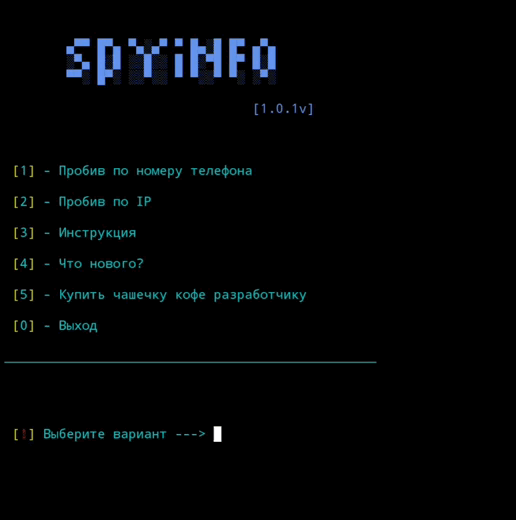

# SpyInfo

_____
### Утилита для просмотра местоположения носителя номера телефона или IP - адрес

Программа работает в терминалах Linux, Windows, Mac и даже в Termux!

#### Запускаем утилиту
Клонируем проект:
```
git clone https://github.com/LevCoding/spyinfo
```
Переходим в папку и запускаем проект:
```
cd spyinfo
python spyinfo.py
```
#### !!! Для этого в ваш терминал должен быть установлен git и python


Если телефон подключён к интернету/WiFi, то вы узнаете не местополодение телефона, а место нахождение роутера. **Чтобы определить точный IP - адрес, нужно
убедиться, что прослеживаемый IP отключён от WiFi или интернета.**
